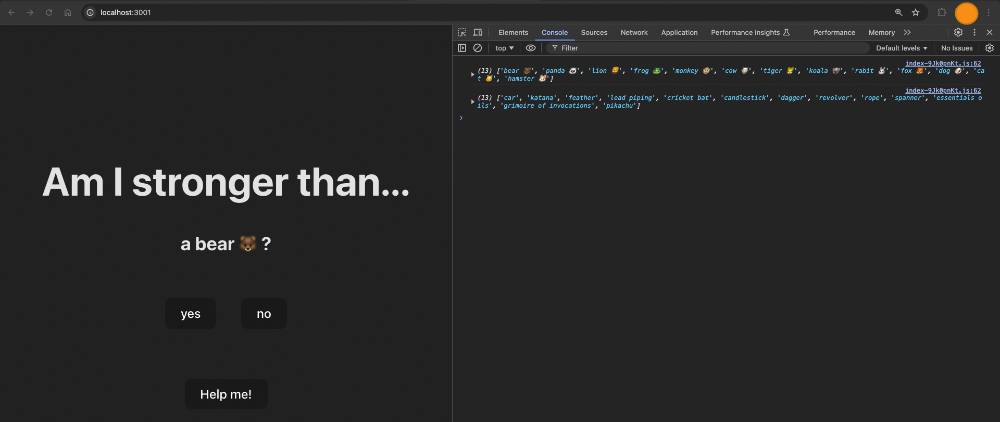
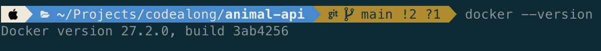
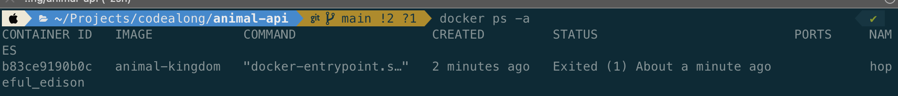
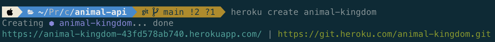
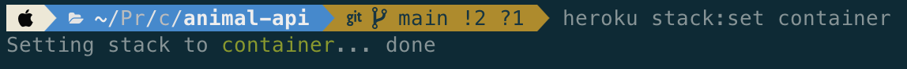

# Docker

## Índice

1. [Introducción](#1-introducción)
2. [Instalaciones](#2-instalaciones)
3. [Conceptos Fundamentales](#3-conceptos-fundamentales)
4. [Flujo de Trabajo en Docker](#4-flujo-de-trabajo-en-docker)
5. [Comandos Esenciales](#5-comandos-esenciales)
6. [Ejemplo Completo: Proyecto NodeJS](#6-ejemplo-con-nodejs)
7. [Subir imagen a Docker Hub](#7-subir-imagen-a-docker-hub)
8. [Despliegue en Heroku](#8-despliegue-en-heroku)
9. [Ejemplo Completo: Proyecto Python](#9-ejemplo-con-python)
10. [Extra: Despliegue en producción](#10-despliegue-en-producción)
11. [Recursos Adicionales](#11-recursos-adicionales)

---

## 1. Introducción

<kbd></kbd>

[Docker (WEB)](https://www.docker.com/) 🌐: Develop faster. Run anywhere. Accelerate how you build, share, and run applications

🚀 Docker permite empaquetar aplicaciones con todas sus dependencias, como librerías y versiones de lenguajes, en contenedores ligeros. Esto asegura que la aplicación funcione igual en cualquier entorno, evitando problemas de compatibilidad entre desarrollo y producción.

👨‍💻 Solomon Hykes quería que el código de los programadores funcionara igual en desarrollo y producción. Docker hizo que los contenedores fueran fáciles de usar, aunque ya existían en Linux. Aunque lanzaron Docker gratis y fue popular, la empresa tuvo problemas para ganar dinero y terminó vendiendo parte de su negocio en 2020.

💻 Antes de Docker, las máquinas virtuales (VMs) eran la opción para aislar aplicaciones. Las VMs emulan un sistema operativo completo, lo que las hace más pesadas y lentas. Además, ocupan más espacio y consumen más recursos que Docker, lo que dificulta la escalabilidad y el rendimiento.

<kbd>
  
</kbd>

🚨 ¿Entendemos para qué sirve? ¿Qué puede pasar en el caso de no usar? ¿Qué se usaba antes? 🚨

## 2. Instalaciones

### Instalar Docker en varios sistemas operativos

- **[Docker Desktop](https://www.docker.com/products/docker-desktop/)** (para Windows y macOS): Una interfaz gráfica que incluye Docker CLI y Docker Compose, permitiendo gestionar contenedores de manera sencilla.
  <kbd></kbd>
- **Docker CLI** (para Linux): En Linux, Docker se instala directamente como una herramienta de línea de comandos (CLI) que se gestiona desde el terminal. Los comandos permiten crear y ejecutar contenedores de manera directa. Instrucciones para instalar en [Ubuntu](https://docs.docker.com/engine/install/ubuntu/), [CentOS](https://docs.docker.com/engine/install/centos/), [Debian](https://docs.docker.com/engine/install/debian/).
  <kbd></kbd>
- **[Docker Hub](https://hub.docker.com/)**: Es el repositorio oficial donde se almacenan y comparten imágenes de Docker. Los usuarios pueden descargar imágenes públicas o almacenar las suyas propias. Es un recurso clave para obtener imágenes oficiales de sistemas operativos, aplicaciones y servicios. Como Github
  <kbd></kbd>

### Problemas con procesadores

- **Problemas comunes al instalar Docker en procesadores antiguos** Algunos usuarios pueden experimentar problemas al instalar Docker en máquinas con procesadores **AMD** o **Intel** antiguos, ya que Docker depende de la virtualización para funcionar. Es importante verificar que tu procesador tenga **soporte para virtualización** (VT-x en Intel o AMD-V en AMD) y que esté habilitado en la BIOS.

      En equipos Windows, asegúrate de que Hyper-V esté activado, ya que Docker Desktop utiliza esta tecnología para crear contenedores.

      En macOS, Docker utiliza el **Apple Hypervisor Framework**.

- **Considera la arquitectura de tu procesador** Las arquitecturas `amd64` y `arm64` se refieren a diferentes conjuntos de instrucciones que los procesadores utilizan para ejecutar programas.

      amd64 (x86-64): Desarrollada por AMD, pero basada en la arquitectura x86 de Intel. Es la más común en PCs y servidores.

      arm64 (ARMv8-A o AArch64): Desarrollada por ARM Holdings, se utiliza en dispositivos móviles y servidores. Es más eficiente y multinúcleo. Es popular en dispositivos como Raspberry Pi Apple M1/M2, y en la nube con AWS Graviton.

      Las imágenes de Docker se crean y optimizan para una arquitectura específica. Esto significa que una imagen creada para amd64 (procesadores Intel y AMD de 64 bits) no se puede ejecutar de forma nativa en arm64 (procesadores ARM).  Comando para construir una imagen multiarquitectura:

      docker buildx build --platform linux/amd64,linux/arm64 -t mi-imagen:latest .

🚨 🚨 ¿Entendéis lo que necesitamos? ¿Entendís el problema de la arquitectura de tu procesador? 🚨 🚨

## 3. Conceptos fundamentales

<kbd></kbd>

📖 **Dockerfile**: Es como una receta que especifica, paso a paso, cómo preparar un entorno en el que se ejecutará una aplicación.

🖼️ **Imágenes**: Una imagen es una plantilla que contiene todo lo necesario para ejecutar un contenedor: el código de la aplicación, el entorno de ejecución, las dependencias, etc. Las imágenes pueden ser compartidas a través de repositorios como **[Docker Hub](https://hub.docker.com/)**. Las imágenes se crean a partir de un Dockerfile y se pueden ejecutar como contenedores.

📦 **Contenedores**: Un contenedor es una instancia en ejecución de una imagen. Es el entorno aislado en el que se ejecuta la aplicación. Cada contenedor tiene su propio sistema de archivos, procesos, redes y espacio de CPU/memoria. Piensa en el contenedor como una "caja" donde vive y se ejecuta la aplicación, separada del resto del sistema.

💾 Volúmenes: Los volúmenes en Docker se utilizan para persistir datos más allá del ciclo de vida de los contenedores, los cuales son efímeros y pueden ser eliminados fácilmente. Los volúmenes permiten que los datos persistan incluso después de que el contenedor haya sido destruido. Además, también se pueden utilizar para mapear código entre el sistema anfitrión y el contenedor, lo que facilita la edición en tiempo real dentro del contenedor.

📜 **Docker Compose**: Docker Compose es una herramienta que permite definir y ejecutar aplicaciones multicontenedor. Se utiliza un archivo `docker-compose.yml` para configurar los servicios de una aplicación, como bases de datos, servidores, etc., y luego se ejecutan con un solo comando.

🚨 🚨 ¿Sabemos qué es una imagen, un contenedor, un volumen y lo que hace el docker compose? 🚨 🚨

## 4. Flujo de trabajo en docker

<p>
  
</p>

El flujo de trabajo en Docker sigue varios pasos clave que van desde la creación de una imagen hasta la ejecución de un contenedor. A continuación, te explicamos el proceso paso a paso, además de algunos conceptos relacionados con la configuración de variables y el ciclo de vida de los contenedores.

### 4.1. Creación del Dockerfile

Se puede hacer con `docker init` te detecta el code que tienes

Ejemplo básico de un Dockerfile:

      FROM python:3.8-slim # Instalamos una imagen
      COPY . /app # Copiamos un directorio
      WORKDIR /app # Creamos un directorio
      RUN pip install -r requirements.txt # Instalamos
      CMD ["python", "app.py"] # Ejecutamos

### 4.1. Construcción de la Imagen

      docker build -t mi-aplicacion:latest .

### 4.2 Configurar variables en el Dockerfile de forma sencilla

Durante la ejecución de un contenedor, puedes pasar variables de entorno para personalizar la configuración sin modificar el código. Puedes definir variables directamente en el Dockerfile o pasar valores al momento de ejecutar el contenedor.

      # En el dockerfile
      ENV API_KEY=myapikey

      # O pasarla en momento de ejecución
      docker run -e API_KEY=myapikey mi-aplicacion

📌 Importante diferenciar entre ARG y ENV. ARG define variables que se pasan en tiempo de construcción. ENV define variables que se usan en tiempo de ejecución dentro del contenedor.

    ARG BUILD_ENV=development
    ENV APP_ENV=${BUILD_ENV}
    RUN echo "Building for environment: ${APP_ENV}``

### 4.3 Ejecutar un contenedor

      docker run -d --name mi-contenedor -p 8080:80 mi-aplicacion

Este comando ejecuta el contenedor en segundo plano (-d), asigna el nombre mi-contenedor, y mapea el puerto 80 del contenedor al puerto 8080 del host (-p 8080:80).

### 4.4 Ejecutar varios contenedores a la vez

En Docker Compose, un servicio es una definición que describe un contenedor que deseas ejecutar. Cada servicio corresponde a un contenedor, y en el archivo docker-compose.yaml, puedes definir varios servicios para que trabajen juntos como parte de una aplicación más grande

Cuando ejecutas `docker-compose up`, Docker Compose realiza las siguientes tareas: Crea y ejecuta los contenedores para cada servicio, Asigna una red. Monta volúmenes y expone puertos.

Ejemplo de Docker compose:

    services:
      app:
        image: mi-aplicacion:latest
          - "8080:8080"
        depends_on:
          - db  # 'app' depende del servicio 'db'
      db:
        image: postgres:13  # Este servicio es la base de datos
        environment:
          - POSTGRES_USER=user
          - POSTGRES_PASSWORD=secret
          - POSTGRES_DB=mi_bd

📌 Importante recordar que docker-compose puede acceder al .env

🚨 🚨 ¿Podemos explicar el flujo de trabajo con Docker? ¿Diferenciamos entre ARG y ENV? ¿Entendemos la función de docker-compose? 🚨 🚨

## 5. Comandos esenciales

- **`docker --version`**: Verifica la versión de Docker instalada.
- **`docker pull <imagen>`**: Descarga una imagen de Docker del repositorio de Docker Hub.
- **`docker push <imagen>`**: Sube una imagen a un registro (registry).
- **`docker images`**: Lista todas las imágenes descargadas en tu máquina.
- **`docker run <imagen>`**: Ejecuta un contenedor a partir de una imagen.
- **`docker ps`**: Muestra todos los contenedores en ejecución.
- **`docker ps -a`**: Muestra todos los contenedores, incluso los que no están en ejecución.
- **`docker stop <id-contenedor>`**: Detiene un contenedor en ejecución.
- **`docker start <id-contenedor>`**: Inicia un contenedor que ha sido detenido.
- **`docker rm <id-contenedor>`**: Elimina un contenedor detenido.
- **`docker rmi <imagen>`**: Elimina una imagen de Docker.
- **`docker build -t <nombre>:<tag> <directorio>`**: Construye una imagen a partir de un Dockerfile.
- **`docker exec -it <id-contenedor> <comando>`**: Ejecuta un comando dentro de un contenedor en ejecución.
- **`docker logs <id-contenedor>`**: Muestra los logs de un contenedor.
- **`docker-compose up`**: Inicia los contenedores definidos en un archivo `docker-compose.yml`.
- **`docker-compose down`**: Detiene y elimina los contenedores definidos en `docker-compose.yml`.
- **`docker inspect <id-contenedor>`**: Muestra detalles de un contenedor o una imagen.
- **`docker stats`**: Muestra el uso de recursos de los contenedores en ejecución.
- **`docker prune`**: Elimina imágenes no utilizadas.

🚨 🚨 ¿Me suenan los comandos esenciales? 🚨 🚨

## 6. Ejemplo con NodeJS

En este apartado vamos a transformar un proyecto nodejs full-stack en una única imagen de Docker para poder almacenarla, compartirla, ejecutarla y desplegarla en un entorno de producción.

### Getting started

<details>
  <summary>Guía paso a paso de instalación</summary>

1. Ejecuta el comando `npm install` para ambos proyectos
2. Recuerda que `animal-api` necesita un fichero `.env para la variable PORT`
3. Familiarizate con ambos proyectos
4. Genera una build del proyecto `animal-front` con `npm run build` y copia la nueva `carpeta dist` en la raíz del proyecto `animal-api`
5. Ejecuta el proyecto `animal-api` con `npm run start`

Si todo ha ido bien deberías tener disponible el proyecto `animal-api` corriendo en el puerto `http://localhost:3001` sirviendo los archivos estáticos de la carpeta `dist` en su raíz. Observa commo la información que recibidos de los endpoints de la API aparecen en la consola de tu navegador:

<p>
  
</p>

> [!IMPORTANT]  
> Asegúrate de tener [instalado docker](https://docs.docker.com/engine/install/) en tu ordenador junto con el interfad docker-desktop:

<p>
  
</p>

</details>

### 6.1 Crear un archivo Dockerfile

El primer paso será `crear un archivo Dockerfile` que defina el como será la imagen de la aplicación:

```dockerfile
# 1. Usamos una imagen base de Node.js versión LTS (Long Term Support)
FROM node:18

# 2. Establece un directorio de trabajo en el contenedor: todo el código se copiará aquí.
WORKDIR /app

# 3. Copia el package.json y package-lock.json al contenedor para instalar las dependencias antes de copiar todo el código.
COPY package*.json ./

# 4. Instala solo las dependencias necesarias para producción. Si también quieres instalar las dependencias de desarrollo, omite --production.
RUN npm install --production

# 5. Copiar el resto del código fuente de la aplicación al contenedor
COPY . .

# 6. Exponer el puerto en el que tu aplicación estará escuchando
EXPOSE 3001

# 7. Este comando ejecuta tu aplicación, asumiendo que tienes un script start en el package.json como: "start": "node index.js".
CMD ["npm", "start"]

```

### 6.2 Crear un archivo .dockerignore

El archivo `.dockerignore` es útil para evitar que ciertos archivos sean copiados al contenedor. De manera similar al fichero .gitignore, el objetivo es evitar compartir ficheros y recursos que por su propia naturaleza se auto-generan durante el proceso de ejecución. El objetivo es hacer `una imagen lo más liviana y eficiente posible`:

```.dockerignore
node_modules
npm-debug.log
.DS_Store
.git
.gitignore
.env

```

Este archivo excluye directorios y archivos innecesarios como `node_modules`, archivos de configuración de Git, y archivos de entorno sensibles como `.env`.

### 6.3 Construir la imagen de Docker

Para construir la imagen de Docker, debemos ejecutar el siguiente comando `en la raíz de nuestro proyecto`:

```bash
docker build -t my-node-app .
```

> [!TIP]
> Recuerda que puedes usar el comando `docker images` para visualizar todas las imágenes en tu máquina (o usar el interfaz de docker desktop):

<p>
  
</p>

> [!NOTE]
> Las imágenes de Docker se almacenan en el sistema de archivos que Docker usa internamente, llamado **overlayFS** (en la mayoría de los sistemas modernos), que almacena la información de las capas de las imágenes. Docker no almacena las imágenes como archivos únicos, sino que las divide en capas que se comparten entre diferentes imágenes para ahorrar espacio.

### 6.4 Ejecutar un contenedor

Vamos a ejecutar un contenedor (a.k.a instanciar nuestra imagen) en el puerto 3001 con el siguiente comando:

```bash
docker run -p 3001:3001 my-node-app
```

> [!WARNING]
> Si tienes un archivo `.env` para variables de entorno, asegúrate de pasarlo al contenedor definiendo `--env-file`:

```bash
docker run --env-file .env -p 3001:3001 my-node-app
```

> [!TIP]
> Recuerda que puedes usar el comando `docker ps -a` para visualizar todas las instancias en tu máquina (o usar el interfaz de docker desktop):

<p>
  
</p>

### 6.5 Ejecutar otro contenedor

_easy peasy_

```bash
docker run -p 3000:3000 -e PORT=3000 my-node-app
```

### 6.6 Crear un volumen para node_modules (opcional)

Si estás desarrollando localmente y no quieres reinstalar las dependencias cada vez que construyas la imagen, puedes usar volúmenes para mantener los módulos fuera de la imagen. Esto lo puedes hacer al correr el contenedor:

```bash
docker run -p 3001:3001 -v $(pwd):/app -v /app/node_modules my-node-app
```

Esto asegura que los cambios en el código fuente sean reflejados sin necesidad de reconstruir la imagen cada vez.

## 7. Subir imagen a Docker Hub

`Docker Desktop` es una aplicación local que facilita la creación, ejecución y gestión de contenedores en tu computadora. Es una plataforma todo-en-uno que incluye:

- `Docker Engine`: El motor que permite construir y correr contenedores localmente.
- `Docker CLI`: Herramienta de línea de comandos para interactuar con Docker, como construir imágenes, ejecutar contenedores y gestionar el ecosistema.
- `Docker Compose`: Una herramienta para definir y correr aplicaciones multi-contenedor mediante un archivo docker-compose.yml.
- `Máquina virtual`: En macOS y Windows, Docker Desktop utiliza una VM (máquina virtual) para ejecutar Linux, ya que Docker depende del kernel de Linux.

Entre las funciones de Docker Desktop está construir imágenes Docker desde un Dockerfile y ejecutar y gestionar contenedores localmente.

`Docker Hub` es un servicio en la nube que actúa como un registro de imágenes Docker, similar a un repositorio de código (como GitHub o GitLab), pero especializado en imágenes Docker. Docker Hub nos permite:

- Almacenar y compartir imágenes Docker públicamente o de manera privada.
- Distribuir tus imágenes a otras personas o sistemas (en un entorno de producción, CI/CD, etc.).
- Descargar imágenes preconstruidas de aplicaciones populares (Nginx, Redis, MongoDB, Node.js, etc.), que puedes usar como base para tus propios contenedores.

Una vez que has construido una imagen localmente usando Docker Desktop, podemos subir (empujar) esa imagen a Docker Hub para compartirla o almacenarla en la nube:

1. Primero debemos autenticarnos en Docker Hub:

```bash
docker login
```

2. Ponerle una etiqueta de referencia a nuestra imagen:

```bash
docker tag my-node-app your-dockerhub-username/my-node-app
```

3. _Pushear_ la imagen a Docker Hub:

```bash
docker push your-dockerhub-username/my-node-app
```

En resumen, Docker Desktop te permite trabajar en tu máquina local, mientras que Docker Hub actúa como un repositorio centralizado donde puedes almacenar y compartir tus imágenes Docker.

## 8. Despliegue en Heroku

Llegados a este punto, vamos a intentar lanzar nuestro proyecto a un entorno real de producción utilizando la imagen que ya tenemos generada. Para ello vamos a utilizar Heroku por su simplicidad y fácil configuración a través de su [CLI](https://devcenter.heroku.com/articles/heroku-cli).

<details>
  <summary>Otras plataformas de Cloud Computing (PaaS) con Soporte Docker</summary>

- AWS Elastic Beanstalk (con Docker)
- Google Cloud Run
- Microsoft Azure App Service (con Docker)

</details>

### 8.1 Instalar Heroku CLI

Lo primero que debemos hacer es descargar el [CLI de Heroku](https://devcenter.heroku.com/articles/heroku-cli#install-the-heroku-cli) y comprobar su instalación:

```bash
heroku --version
```

### 8.2 Iniciar sesión en Heroku

Este comando abrirá una ventana del navegador para que ingreses tus credenciales de Heroku. Una vez que inicies sesión, la CLI estará autenticada:

```bash
heroku login
```

### 8.3 Crear una aplicación en Heroku

```bash
heroku create my-node-app
```

<p>
  
</p>

### 8.4 Configurar Heroku para usar Docker

Aunque existen diversar formar de configurar Heroku para que emplee Docker, lo más sencillo es utilizar el propio Dockerfile en la raíz de nuestro proyecto iniciando sesión en Docker:

```bash
heroku container:login
```

> [!NOTE]
> Este comando autentica tu sesión de Docker para que puedas interactuar con Heroku Container Registry.

### 8.5 Construir y enviar la imagen Docker a Heroku

El siguiente paso es construir y enviar la imagen Docker a Heroku. Heroku llamará al proceso web por defecto, así que vamos a mantener la etiqueta web al subir tu imagen.

```bash
heroku container:push web -a my-node-app
```

> [!WARNING]
> Debido a las configuraciones por defecto, es posible que la app generada no esté prepara para docker. En este caso, debemos introducir el siguiente comando:

```bash
heroku stack:set container
```

<p>
  
</p>

### 8.6 Liberar la imagen Docker en Heroku

Una vez que la imagen haya sido subida a Heroku, debes lanzar tu contenedor para que Heroku lo ejecute en su plataforma. Este comando libera la imagen y despliega tu aplicación en Heroku:

```bash
heroku container:release web -a my-node-app
```

### 8.7 Verificar que la aplicación esté en funcionamiento

Una vez que tu contenedor ha sido liberado, puedes verificar que tu aplicación esté corriendo en Heroku. Heroku te proporcionará un dominio para tu aplicación.

```bash
heroku open -a my-node-app
```

### 8.8 Resumen de comandos:

- **`heroku login`**: Instalar Heroku CLI y autenticarse
- **`heroku create my-node-app`**: Crear una nueva aplicación en Heroku
- **`heroku container:login`**: Iniciar sesión en Docker
- **`heroku container:push web -a my-node-app`**: Construir y subir la imagen Docker a Heroku
- **`heroku container:release web -a my-node-app`**: Liberar la imagen para producción
- **`heroku open -a my-node-app`**: Abrir la aplicación
- **`heroku logs --tail -a my-node-app`**: Ver logs de la aplicación

## 9. Ejemplo con Python

Nos ponemos a hacer instalaciones y un ejemplo práctico de cómo crear, configurar y desplegar un contenedor de Docker para un proyecto en Python.

## 10. Despliegue en producción

- Haces login con `docker login`
- Subes tu imagen a Docker hub etiquetada correctamente. Ejemplo: `docker tag nombre-de-tag:latest tu-username/nombre-de-imagen:latest`
- Te creas tu cuenta en Render
- Creas un nuevo servico web con Docker
- Despliegas tu imagen `docker image push tu-username/nombre-de-tag`

<kbd></kbd>

## 11. Recursos Adicionales

- [Introduction to Docker (PDF)](https://jorgebenitezlopez.com/tiddlywiki/pro/Introduction-to-docker-dark.pdf)
- [Curso práctico de Docker y Kubernetes](https://www.freecodecamp.org/news/learn-docker-and-kubernetes-hands-on-course/)

**[⬆ back to top](#índice)**
