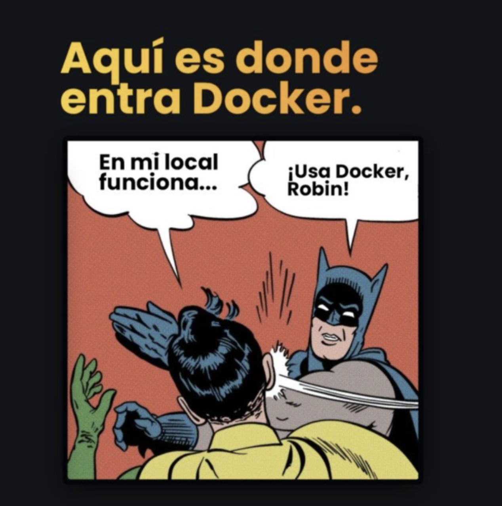
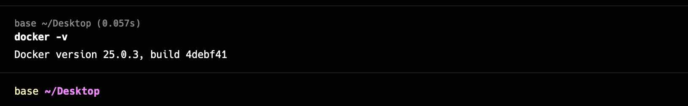
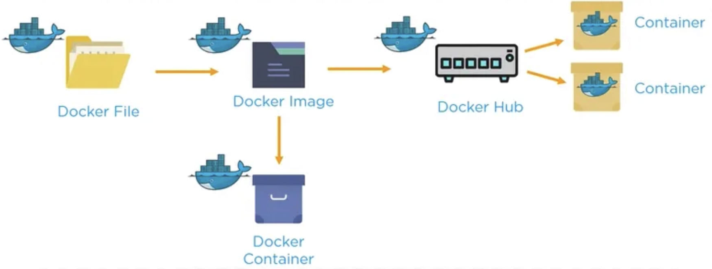

# Docker

## Índice

1. [Introducción](#1-introducción)
2. [Instalaciones](#2-instalaciones)
3. [Conceptos Fundamentales](#3-conceptos-fundamentales)
4. [Flujo de Trabajo en Docker](#4-flujo-de-trabajo-en-docker)
5. [Comandos Esenciales](#5-comandos-esenciales)
6. [Ejemplo Completo: Proyecto Python](#6-ejemplo-con-python)
7. [Extra: Despliegue en producción](#6-despliegue-en-producción)
8. [Recursos Adicionales](#7-recursos-adicionales)

---

## 1. Introducción

<kbd></kbd>

[Docker (WEB)](https://www.docker.com/) 🌐: Develop faster. Run anywhere. Accelerate how you build, share, and run applications

🚀 Docker permite empaquetar aplicaciones con todas sus dependencias, como librerías y versiones de lenguajes, en contenedores ligeros. Esto asegura que la aplicación funcione igual en cualquier entorno, evitando problemas de compatibilidad entre desarrollo y producción.

👨‍💻 Solomon Hykes quería que el código de los programadores funcionara igual en desarrollo y producción. Docker hizo que los contenedores fueran fáciles de usar, aunque ya existían en Linux. Aunque lanzaron Docker gratis y fue popular, la empresa tuvo problemas para ganar dinero y terminó vendiendo parte de su negocio en 2020.

💻 Antes de Docker, las máquinas virtuales (VMs) eran la opción para aislar aplicaciones. Las VMs emulan un sistema operativo completo, lo que las hace más pesadas y lentas. Además, ocupan más espacio y consumen más recursos que Docker, lo que dificulta la escalabilidad y el rendimiento.

<kbd>
  
</kbd>

🚨 ¿Entendemos para qué sirve? ¿Qué puede pasar en el caso de no usar? ¿Qué se usaba antes? 🚨

## 2. Instalaciones

### Instalar Docker en varios sistemas operativos

- **[Docker Desktop](https://www.docker.com/products/docker-desktop/)** (para Windows y macOS): Una interfaz gráfica que incluye Docker CLI y Docker Compose, permitiendo gestionar contenedores de manera sencilla.
  <kbd></kbd>
- **Docker CLI** (para Linux): En Linux, Docker se instala directamente como una herramienta de línea de comandos (CLI) que se gestiona desde el terminal. Los comandos permiten crear y ejecutar contenedores de manera directa. Instrucciones para instalar en [Ubuntu](https://docs.docker.com/engine/install/ubuntu/), [CentOS](https://docs.docker.com/engine/install/centos/), [Debian](https://docs.docker.com/engine/install/debian/).
  <kbd></kbd>
- **[Docker Hub](https://hub.docker.com/)**: Es el repositorio oficial donde se almacenan y comparten imágenes de Docker. Los usuarios pueden descargar imágenes públicas o almacenar las suyas propias. Es un recurso clave para obtener imágenes oficiales de sistemas operativos, aplicaciones y servicios. Como Github
  <kbd></kbd>

### Problemas con procesadores

- **Problemas comunes al instalar Docker en procesadores antiguos** Algunos usuarios pueden experimentar problemas al instalar Docker en máquinas con procesadores **AMD** o **Intel** antiguos, ya que Docker depende de la virtualización para funcionar. Es importante verificar que tu procesador tenga **soporte para virtualización** (VT-x en Intel o AMD-V en AMD) y que esté habilitado en la BIOS.

      En equipos Windows, asegúrate de que Hyper-V esté activado, ya que Docker Desktop utiliza esta tecnología para crear contenedores.

      En macOS, Docker utiliza el **Apple Hypervisor Framework**.

- **Considera la arquitectura de tu procesador** Las arquitecturas `amd64` y `arm64` se refieren a diferentes conjuntos de instrucciones que los procesadores utilizan para ejecutar programas.

      amd64 (x86-64): Desarrollada por AMD, pero basada en la arquitectura x86 de Intel. Es la más común en PCs y servidores.

      arm64 (ARMv8-A o AArch64): Desarrollada por ARM Holdings, se utiliza en dispositivos móviles y servidores. Es más eficiente y multinúcleo. Es popular en dispositivos como Raspberry Pi Apple M1/M2, y en la nube con AWS Graviton.

      Las imágenes de Docker se crean y optimizan para una arquitectura específica. Esto significa que una imagen creada para amd64 (procesadores Intel y AMD de 64 bits) no se puede ejecutar de forma nativa en arm64 (procesadores ARM).  Comando para construir una imagen multiarquitectura:

      docker buildx build --platform linux/amd64,linux/arm64 -t mi-imagen:latest .

🚨 🚨 ¿Entendéis lo que necesitamos? ¿Entendís el problema de la arquitectura de tu procesador?  🚨 🚨

## 3. Conceptos fundamentales

<kbd></kbd>

📖 **Dockerfile**: Es como una receta que especifica, paso a paso, cómo preparar un entorno en el que se ejecutará una aplicación.

🖼️ **Imágenes**: Una imagen es una plantilla que contiene todo lo necesario para ejecutar un contenedor: el código de la aplicación, el entorno de ejecución, las dependencias, etc. Las imágenes pueden ser compartidas a través de repositorios como **[Docker Hub](https://hub.docker.com/)**. Las imágenes se crean a partir de un Dockerfile y se pueden ejecutar como contenedores.

📦 **Contenedores**: Un contenedor es una instancia en ejecución de una imagen. Es el entorno aislado en el que se ejecuta la aplicación. Cada contenedor tiene su propio sistema de archivos, procesos, redes y espacio de CPU/memoria. Piensa en el contenedor como una "caja" donde vive y se ejecuta la aplicación, separada del resto del sistema.

💾 **Volúmenes**: Los volúmenes se utilizan para persistir datos más allá del ciclo de vida del contenedor. Los contenedores son efímeros y se eliminan fácilmente, pero los volúmenes permiten que los datos persistan, incluso después de que el contenedor ha sido destruido.

📜 **Docker Compose**: Docker Compose es una herramienta que permite definir y ejecutar aplicaciones multicontenedor. Se utiliza un archivo `docker-compose.yml` para configurar los servicios de una aplicación, como bases de datos, servidores, etc., y luego se ejecutan con un solo comando.

🚨 🚨 ¿Sabemos qué es una imagen, un contenedor, un volumen y lo que hace el docker compose? 🚨 🚨

## 4. Flujo de trabajo en docker

  

El flujo de trabajo en Docker sigue varios pasos clave que van desde la creación de una imagen hasta la ejecución de un contenedor. A continuación, te explicamos el proceso paso a paso, además de algunos conceptos relacionados con la configuración de variables y el ciclo de vida de los contenedores.

### 4.1. Creación del Dockerfile

Se puede hacer con `docker init` te detecta el code que tienes

Ejemplo básico de un Dockerfile:

      FROM python:3.8-slim # Instalamos una imagen
      COPY . /app # Copiamos un directorio
      WORKDIR /app # Creamos un directorio
      RUN pip install -r requirements.txt # Instalamos
      CMD ["python", "app.py"] # Ejecutamos

### 4.1. Construcción de la Imagen

      docker build -t mi-aplicacion:latest .

### 4.2 Configurar variables en el Dockerfile de forma sencilla

Durante la ejecución de un contenedor, puedes pasar variables de entorno para personalizar la configuración sin modificar el código. Puedes definir variables directamente en el Dockerfile o pasar valores al momento de ejecutar el contenedor.

      # En el dockerfile
      ENV API_KEY=myapikey

      # O pasarla en momento de ejecución
      docker run -e API_KEY=myapikey mi-aplicacion

📌 Importante diferenciar entre ARG y ENV. ARG define variables que se pasan en tiempo de construcción. ENV define variables que se usan en tiempo de ejecución dentro del contenedor.

    ARG BUILD_ENV=development
    ENV APP_ENV=${BUILD_ENV}
    RUN echo "Building for environment: ${APP_ENV}``

### 4.3 Ejecutar un contenedor

      docker run -d --name mi-contenedor -p 8080:80 mi-aplicacion

Este comando ejecuta el contenedor en segundo plano (-d), asigna el nombre mi-contenedor, y mapea el puerto 80 del contenedor al puerto 8080 del host (-p 8080:80).

### 4.4 Ejecutar varios contenedores a la vez

En Docker Compose, un servicio es una definición que describe un contenedor que deseas ejecutar. Cada servicio corresponde a un contenedor, y en el archivo docker-compose.yaml, puedes definir varios servicios para que trabajen juntos como parte de una aplicación más grande

Cuando ejecutas `docker-compose up`, Docker Compose realiza las siguientes tareas: Crea y ejecuta los contenedores para cada servicio, Asigna una red. Monta volúmenes y expone puertos.

Ejemplo de Docker compose:

    services:
      app:
        image: mi-aplicacion:latest
          - "8080:8080"
        depends_on:
          - db  # 'app' depende del servicio 'db'
      db:
        image: postgres:13  # Este servicio es la base de datos
        environment:
          - POSTGRES_USER=user
          - POSTGRES_PASSWORD=secret
          - POSTGRES_DB=mi_bd

📌 Importante recordar que docker-compose puede acceder al .env

🚨 🚨 ¿Podemos explicar el flujo de trabajo con Docker? ¿Diferenciamos entre ARG y ENV? ¿Entendemos la función de docker-compose? 🚨 🚨

## 5. Comandos esenciales

- **`docker --version`**: Verifica la versión de Docker instalada.
- **`docker pull <imagen>`**: Descarga una imagen de Docker del repositorio de Docker Hub.
- **`docker push <imagen>`**: Sube una imagen a un registro (registry).
- **`docker images`**: Lista todas las imágenes descargadas en tu máquina.
- **`docker run <imagen>`**: Ejecuta un contenedor a partir de una imagen.
- **`docker ps`**: Muestra todos los contenedores en ejecución.
- **`docker ps -a`**: Muestra todos los contenedores, incluso los que no están en ejecución.
- **`docker stop <id-contenedor>`**: Detiene un contenedor en ejecución.
- **`docker start <id-contenedor>`**: Inicia un contenedor que ha sido detenido.
- **`docker rm <id-contenedor>`**: Elimina un contenedor detenido.
- **`docker rmi <imagen>`**: Elimina una imagen de Docker.
- **`docker build -t <nombre>:<tag> <directorio>`**: Construye una imagen a partir de un Dockerfile.
- **`docker exec -it <id-contenedor> <comando>`**: Ejecuta un comando dentro de un contenedor en ejecución.
- **`docker logs <id-contenedor>`**: Muestra los logs de un contenedor.
- **`docker-compose up`**: Inicia los contenedores definidos en un archivo `docker-compose.yml`.
- **`docker-compose down`**: Detiene y elimina los contenedores definidos en `docker-compose.yml`.
- **`docker inspect <id-contenedor>`**: Muestra detalles de un contenedor o una imagen.
- **`docker stats`**: Muestra el uso de recursos de los contenedores en ejecución.
- **`docker prune`**: Elimina imágenes no utilizadas.

🚨 🚨 ¿Me suenan los comandos esenciales? 🚨 🚨

## 6. Ejemplo con Python

Nos ponemos a hacer instalaciones y un ejemplo práctico de cómo crear, configurar y desplegar un contenedor de Docker para un proyecto en Python.

## 7. Despliegue en producción

- Haces login con `docker login`
- Subes tu imagen a Docker hub etiquetada correctamente. Ejemplo: `docker tag nombre-de-tag:latest tu-username/nombre-de-imagen:latest`
- Te creas tu cuenta en Render
- Creas un nuevo servico web con Docker
- Despliegas tu imagen `docker image push tu-username/nombre-de-tag`

<kbd></kbd>

## 8. Recursos Adicionales

- [Introduction to Docker (PDF)](https://jorgebenitezlopez.com/tiddlywiki/pro/Introduction-to-docker-dark.pdf)
- [Curso práctico de Docker y Kubernetes](https://www.freecodecamp.org/news/learn-docker-and-kubernetes-hands-on-course/)
